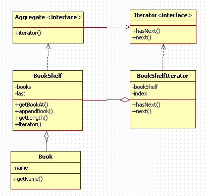

iterator.Iterator(반복한다)
Java 언어에서 배열의 모든 요소를 표시

        for (int i =0; i < arr.length; i++){
            System.out.println(arr[i]);
        }

이때 i 는 0부터 증가 배열의 요소를 차례대로 처리 
여기에서 사용되는 변수 i 의 기능을 추상화해서 일반화 한것이  
<b>iterator.Iterator 패턴</b> 

무엇인가 많이 모여있는 것들을 순서대로 지정하면서 전체를 검색하는 처리를 실행하기 위한 것 

<b>iterator.Iterator(반복자):</b>
- 예제에서는 Iterator인터페이스
- 요소를 순서대로 검색해 가는 인터페이스 결정(hasNext(),next())

<b>ConcreteIterator(구체적인 반복자):</b>
- 예제에서는 iterator.BookShelfIterator
- Iterator가 결정한 인터페이스를 실제로 구현.
- 검색 진행하기 위한 정보 갖기 위해 BookShelf클래스 인스턴스 갖는다.

<b>Aggragate(집합체):</b>
- 검색할 요소가 있는'집합체'역할 나타내는 인터페이스
- iterator()메소드 통해 검색 Itorator구현하도록 설정

<b>ConcreteAggragate(구체적인 집합체):</b>
- 예제에서는 BookShelf클래스
- '집합체'나타내는 인터페이스 구현
- ConcreteIterator 인스턴스 만듬 (집약관계)

<b>예제프로그램</b>
-
서가(iterator.BookShelf)안에 책(iterator.Book) 넣고 책을 차례대로 표시하는 프로그램. 

 

<b>iterator를 사용하는 이유</b>

for문 이용해서 빙글빙글 돌리면 될텐데 iterator사용하는 이유는 
집합체의 구현과 분리해서 하나씩 셀 수 있기 때문. 

     var it:iterator.Iterator = bookShelf.iterator()
        while (it.hasNext()){
            var book: iterator.Book = it.next() as iterator.Book
            println(book.name)
        }

여기서 집합체의 요소를 확인하는데 사용된 건 오직 Iterator의 메소드 뿐. 
BookShelf의 구현에는 전혀 의존하고 있지 않다.  
즉, BookShelf를 Vector로 수정했다고 해도 BookShelf가 올바른 Iterator메소드를 
반환해 준다면 while루프는 전혀 변경하지 않아도 동작함. 

