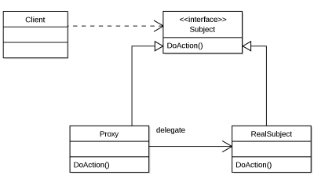

Proxy 패턴의 등장인물 
------------

**Subject(주체)의 역할** 
  
  1. Proxy 역할과 RealSubject 역할을 동일시 하기 위한 인터페이스(API)를 결정한다. 
  2. Subject 덕분에 Client는 Proxy와 RealSubject의 차이를 의식할 필요가 없음. 
  ->RealSubject가 쓰고싶으면 인스턴스화 하는 클래스만 바꿔주면 됨 
  
  예제에서는 Printable
  
**Proxy(대리인)의 역할**
  
  1. 투과적인 클래스 제공하며, Client의 요구를 할 수 있는 만큼 처리. 
  ->PrintProxy클래스를 사용해도 Printer 클래스를 사용하는데 아무 지장이없다.
  
  2. Proxy의 역할은 정말로 RealSubject 역할이 필요해지면 그때 생성해서 사용한다. 
  ->이름의 설정과 취득은 수행하지만 print 메소드는 RealSubject에 위임한다. 
  3. Proxy는RealSubject와 동일시하기 위해 Subject에서 정해지는 인터페이스를 구현한다.  
  
  예제에서는 PrinterProxy
  
**RealSubject(실제 주체)의 역할**
  
  '대리인'인 Proxy역할에서 감당할 수 없는 일이 발생했을 때 등장하는것이 
  '본인'인 RealSubject의 역할.  
   Subject인터페이스를 구현하며, Proxy에 의해 대리된다.
  
   예제에서는 Printer
   
**Client(의뢰인)의 역할**
  
   Proxy 패턴을 이용하는 역할.  
  
   예제에서는 Main
   

 
 대리인을 사용해서 속도 올리기
 ----------  
 Proxy 패턴에서는 Proxy 역할이 대리인이 되어 가능한 일만 처리를 대신한다.  
 이번 예제의 경우 Proxy를 사용함으로서 print할 때까지 무거운처리를(인스턴스 생성) 
 지연시킬 수 있다.
 
 예제에서는 겨우 5초 지연시켰을 뿐이지만, 초기화에 시간이 걸리는 기능이 많이 존재하는 
 대규모 시스탬의 경우 를 생각해 보자. 
 가동 시점에 이용하지 않는 기능까지 전부 초기화 하면 어플리케이션의 기동에 걸리는 
 시간이 지나치게 길어짐.  
 따라서 실제로 그 기능을 사용할 단계가 되어 초기화 하는 편이 사용자의 스트래스를 
 줄여주는 방법이 됨. 

스레드세이프
---
예제에서는 realize메소드와 setPrinterName 메소드에 synchronized 처리함으로서 
스레드 세이프를 구현해놓았다.

만약 스레드 A가 setPrinterName("Bob") 을 호출하자마자 스레드 B가 realize를 호출해서
Printer클래스에 이름을 Alice라 지정하고 인스턴스화 했다고(Printer("Alice") )가정하면 
스레드 A가 다시 역할을 수행하게 되었을때 PrinterProxy 클래스의 name 필드는 "Bob"인상태에서
Alice라는 이름을 가진 Printer클래스를 갖게된다.

관련패턴
-----
Decorator 패턴

Decorator 패턴도 장식의 대상이되는 ConcreateComponent와 장식인 Decorator를 동일시 하기위해 
같은 인터페이스를 상속받는 구조를 취하는 점에서 Proxy 패턴과 구현은 비슷하지만, 목적이 다르다. 
Decorator 패턴의 목적은 새로운 기능을 추가하는 것이지만, Proxy는 새로운 기능을 추가하는 것보다 
본인의 작업을 대리인에게 위임해서 본인에 대한 액세스를 줄여주는 것. 

 

