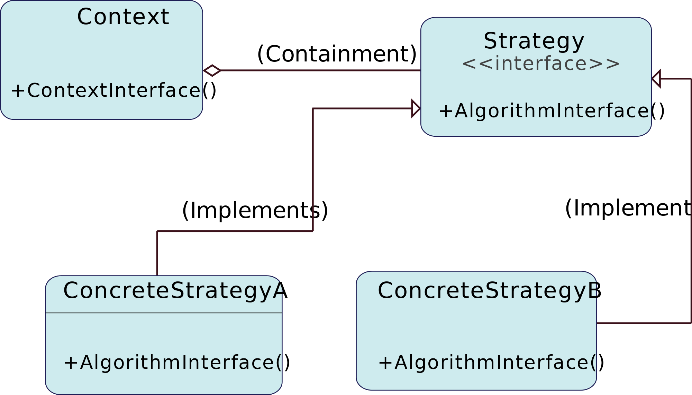

Strategy 패턴
-
Strategy = 전략  
문제를 해결하기 위해 알고리즘을 구현할 부분을 상황에 맞게 교체하는 패턴.
  

 
 ** __예제프로그램은 가위바위보__ ** 
 
전략으로 두가지 방법
1. 이기면 다음에도 같은 손을 내민다.
2. 직전에 냈던 손에서 다음 낼 손을 확률적으로 계산한다.

클래스
-
- Hand : 손을 나타내는 클래스
- Stratege : 전략을 나타내는 인터페이스

- WinningStrategy : 이기면 다음에도 같은 손을 내는 전략을 표시하는 클래스
- ProbStrategy : 직전 손에서 다음 손을 확률적으로 계산하는 전략을 표시하는 클래스
- Main :동작테스트용 클래스

