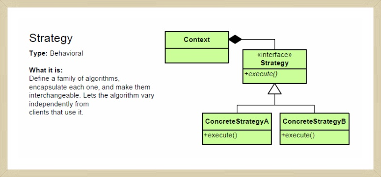

Strategy 패턴
-

Strategy = 전략 <br>
문제를 해결하기 위해 알고리즘을 구현할 부분을 상황에 맞게 교체하는 패턴.
<br><br>

==예제프로그램==

- 사과상자안의 사과를 각 사과의 어떤 속성에 기초해서 찾아내는 프로그램.<br>
- 선택조건을 결정하는 인터페이스를 정의하고 선택된 전략에 따라 인터패이스구현클래스에서 사과의 속성(무게, 색깔)에 따른 판정처리를 한다.<br>
- 즉, 조건에 따라 boolean을 리턴하는Predicate군을 만들어 알고리즘 패밀리를 만들고 상황에 따라 알맞은 패밀리를 불러낸다.<br>



<br>

**일부러 전략패턴 사용할 필요가 있을까?**

- - -

- 전략패턴은 특정 알고리즘을 전체 코드와 의식적으로 분리해서 알고리즘의 인터페이스만 규정하고,프로그램에서 위임에 의해 구현된클래스의 알고리즘을 이용.
- 프로그램을 복잡하게 만드는 것처럼 보이지만 실제로는 그렇지 않다. 알고리즘을 개량해서 좀 더 빠르게 하고 싶다면 스트래티지 패턴 사용하면 구현스트래티지의 역할만 수정하면됨. <br>
- 위임이라는 느슨한 연결을 사용하고 있으므로 알고리즘을 용이하게 교환할 수 있다.<br>

<br>

**실행 중에 교체도 가능**
Strategy 패턴을 사용하면 프로그램의 동작 중에 ConcreteStrategy 역할의 클래스를 교체할 수도 있다.
```
ex)
- 메모리가 적은 환경에서는 SlowButMemoryStrategy 전략
- 메모리가 많은 환경에서는 FastButMoreMemoryStrategy 전략 

```